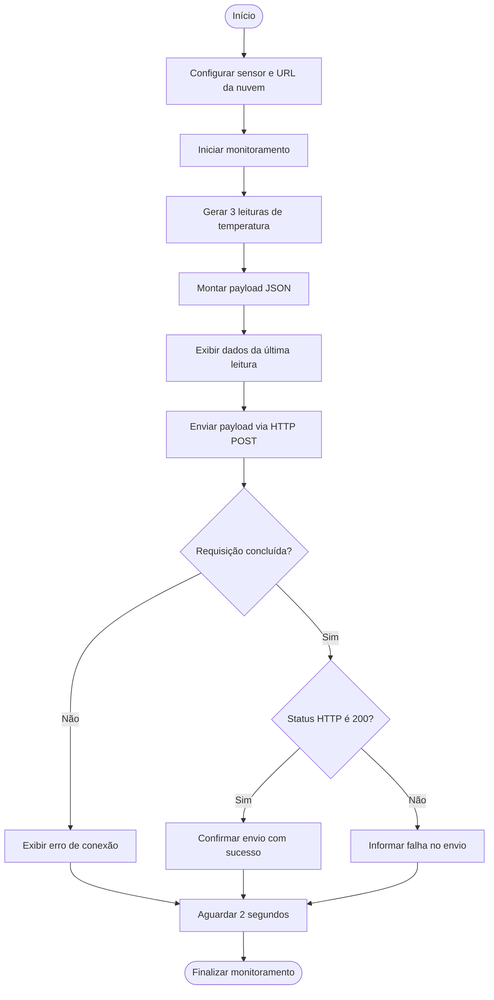

# Aula 01

## Fluxograma — Telemetria IoT

```mermaid
    flowchart TD
        A([Início]) --> B[Configurar sensor e URL da nuvem]
        B --> C[Iniciar monitoramento]
        C --> D[Gerar 3 leituras de temperatura]
        D --> E[Montar payload JSON]
        E --> F[Exibir dados da última leitura]
        F --> G[Enviar payload via HTTP POST]
        G --> H{Requisição concluída?}

        H -- Não --> I[Exibir erro de conexão]
        H -- Sim --> J{Status HTTP é 200?}

        J -- Sim --> K[Confirmar envio com sucesso]
        J -- Não --> L[Informar falha no envio]

        I --> M[Aguardar 2 segundos]
        K --> M
        L --> M

        M --> N([Finalizar monitoramento])
```
